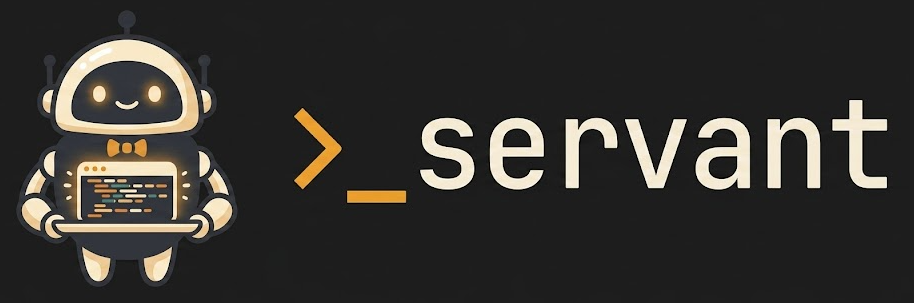

<p align="center">
  <picture>
    <source media="(prefers-color-scheme: dark)" srcset="assets/logo.png"">
    
  </picture>
</p>

<p align="center">
  <em>A CLI that enhances developer and coding-agent workflows — spin up isolated agent workspaces, manage git worktrees, and grow a knowledge base your agents learn from.</em>
</p>

---

`servant` gives every task its own workspace: a dedicated folder, git worktrees of the repos you're working in, and a coding agent (Claude Code) launched in a fresh terminal tab. Sessions are resumable, and durable knowledge is captured automatically so your agents get smarter over time.

```bash
servant spawn -w add-rate-limiter -r    # -w names the workspace; -r picks repos + adds worktrees
servant repo add                        # interactively add another repo's worktree (picker)
servant memories                        # browse what past sessions learned (fzf)
servant insights                        # see how the setup steers agents (tokens, rules, knowledge)
servant fine-tune                       # customize the agent instructions servant ships
```

---

## Contents

- [Requirements](#requirements)
- [Installation](#installation) — including making `servant` available everywhere
- [Quick start](#quick-start)
- [How it works](#how-it-works)
- [Commands](#commands)
- [In-session slash commands](#in-session-slash-commands)
- [Configuration](#configuration)
- [The fzf picker](#the-fzf-picker)
- [Development](#development)

---

## Requirements

| Tool | Why | Install |
|------|-----|---------|
| [Claude Code](https://claude.com/claude-code) | The default coding agent that gets launched | `npm i -g @anthropic-ai/claude-code` |
| [fzf](https://github.com/junegunn/fzf) | Interactive repo/session/memory pickers (optional — there's a numbered fallback) | `brew install fzf` |
| [cmux](https://github.com/manaflow-ai/cmux) or iTerm | Terminal that hosts the agent tabs (auto-detected) | — |
| [Bun](https://bun.sh) ≥ 1.3 | Only to build/hack on servant itself (end users installing via Homebrew don't need it) | `curl -fsSL https://bun.sh/install \| bash` |

---

## Installation

`servant` ships as a self-contained compiled binary — end users need nothing else installed
(no clone, no Bun). Install it from the Homebrew tap:

```bash
brew install Bakar0/tap/servant
servant --version            # prints the release version, e.g. v0.2.0
brew upgrade servant         # later, to pick up a newer release
```

> Contributors who want to hack on servant itself want the source instead — see
> [the three ways to run servant](#the-three-ways-to-run-servant) below.

### First-time setup

```bash
servant init
```

`init` is idempotent and:
- creates the servant root at `~/.ai_servant/`
- writes `config.json` (your repo search roots)
- syncs the bundled agent assets (workspace `CLAUDE.md`, `/servant:*` slash commands, the knowledge-capture hook)
- offers to install the Claude Code status line

---

## Quick start

```bash
# 1. One-time setup
servant init

# 2. Start a task: pick the repos you need, add a worktree of each,
#    and open an agent tab — all in one step.
servant spawn -w add-rate-limiter -r

# 3. Later, jump back into a previous session (fzf picker over history)
servant resume
```

---

## How it works

Everything servant manages lives under a single root, `~/.ai_servant/`:

```
~/.ai_servant/
├── config.json                  # repo search roots, scan depth
├── .cache/repo-discovery.json   # cached repo discovery
├── knowledge/                   # captured memories (git-tracked store)
└── workspaces/<workspace>/
    ├── .claude/                 # synced CLAUDE.md, /servant:* commands, hooks
    └── repos/<repo>__<branch>/  # git worktree of your local clone
```

- A **workspace** is a self-contained folder for one task. The coding agent runs there with its own `CLAUDE.md` and slash commands.
- **Worktrees** use a flat `repos/<repo>__<branch>/` layout — multiple repos per workspace, each a real `git worktree` of your existing local clone (your original checkout is untouched).
- **Assets are CLI-owned and self-healing**: they're re-synced on every `spawn`/`resume`, so updating servant updates every workspace's instructions automatically. Your `fine-tune` overlays are layered on top and preserved.

> Override the root on any command with `--root <path>` — handy for throwaway or test setups.

---

## Commands

Run any command with `--help` for the full flag list.

| Command | What it does |
|---------|--------------|
| `servant init` | One-time, idempotent setup of the servant root, config, and assets. |
| `servant spawn` | Create/enter a workspace and open a terminal tab running a coding agent. |
| `servant repo add\|list\|rm` | Manage git worktrees of your local clones inside a workspace. |
| `servant resume` | Re-attach to a previous Claude Code session. |
| `servant recall` | Search the knowledge base by tag and content; prints matching notes. |
| `servant memories` | Browse the knowledge base in an fzf picker. |
| `servant insights` | Transcript-driven observability across instructions, tokens, and the knowledge base. |
| `servant fine-tune` | Customize servant's instruction assets in a way that survives CLI updates. |
| `servant statusline` | Install the servant status line into Claude Code. |
| `servant extract-memories` | (Mostly internal) capture/reconcile durable knowledge from sessions. |

### `servant spawn`

Create a workspace under `~/.ai_servant/workspaces/<name>` and open a new terminal tab running a coding agent in it.

```bash
servant spawn -w my-task                      # open an agent tab in the workspace
servant spawn -w my-task -r                    # also pick repos + add a worktree per pick first
servant spawn -w my-task -r --branch topic/x   # use a specific branch name for the worktrees
servant spawn -w my-task -p "Read brief.md and start"   # deliver a first prompt to the agent
```

| Flag | Description |
|------|-------------|
| `-w, --workspace` | Workspace name. If omitted, auto-detected from cwd or the current cmux workspace. |
| `-r, --repo` | Before opening the tab, pick local repo(s) and add a worktree per selection (same picker as `repo add`). |
| `--branch` | With `-r`: override the auto-generated branch name (default `<workspace>-<shortid>`). |
| `-p, --prompt` | Initial prompt delivered to the agent as its first message. |
| `--terminal` | `cmux` \| `iterm` (default: auto-detect). |
| `--agent` | Coding agent to launch (default: `claude-code`). |

### `servant repo`

Manage git worktrees of your **local** clones inside a workspace. `repo add` searches the directories in `config.json` (default: your home dir), opens a picker, and creates one worktree per selected repo — all on the same branch.

The common way is to run it **bare** — no arguments needed. The workspace is auto-detected (from your cwd or current cmux workspace), the picker lets you choose the repo(s), and the branch is auto-generated:

```bash
servant repo add                                 # interactive: pick repo(s), auto branch
```

You can also pass any of it explicitly:

```bash
servant repo add api-server                      # pre-filter the picker with a repo hint
servant repo add -w add-rate-limiter --branch topic/x   # target a workspace + name the branch
servant repo list                                # list worktrees in the current workspace
servant repo rm <repo>@<branch>                  # remove one
```

### `servant resume`

Re-attach to a previous Claude Code session in the current tab. With no id, opens an fzf picker over this workspace's session history.

```bash
servant resume                          # fzf-pick from history
servant resume <session-id> --new-tab   # resume a specific session in a new tab
servant resume --prompt "continue"      # resume with a kickoff prompt
```

### Knowledge base — `recall` & `memories`

servant captures durable knowledge from your sessions into `~/.ai_servant/knowledge/` (wired via a Claude Code `SessionEnd` hook). Query it anytime:

```bash
servant recall "auth flow" -n 5    # search by tag + content, print top notes inline
servant memories                   # browse all notes in an fzf picker
servant memories --digest          # non-interactive status digest
```

In-session, agents use the `/servant:recall` and `/servant:extract-memories` slash commands.

### `servant insights`

A feedback loop on how well servant's setup is steering your agents. It mines the Claude Code session transcripts servant already produces — no extra instrumentation — and reports across three areas:

- **Tokens / context window** — peak & final context occupancy, cache-hit ratio, output volume, which tools eat the window, and the static instruction footprint servant imposes per session.
- **Instructions** — `/servant:*` command usage, checkable rule violations (e.g. writing a plan *inside* a repo worktree), tool errors, permission denials, and user-correction turns.
- **Knowledge base** — recall usage and whether results were actually read, plus a store-health scan (note counts, confidence, stale/rotted/orphan/**dead** notes that are never recalled).

Sessions are grouped by a **setup fingerprint** (CLAUDE.md + command bodies + a knowledge signature + the Claude Code version) and aligned to a change ledger, so the digest reads as a **before/after timeline** — change an instruction or fine-tune an overlay, and you can see how the metrics moved.

```bash
servant insights                       # all workspaces, rolling 30 days, all three areas
servant insights -w my-task            # drill into one workspace
servant insights --days 90             # widen the window  (or --since 2026-01-01 / --all)
servant insights --area tokens         # focus one area: tokens | instructions | knowledge
servant insights -s <session-id>       # one session's context-growth curve + per-jump tool drivers
servant insights --json                # machine-readable digest
```

The `-s/--session` view answers "how did the context window grow, when, and what filled it?" for a single session: a sparkline of the per-turn context trajectory, the biggest jumps (turn number · size · the tool result that drove each), and total token spend bucketed by tool.

Metrics live in a git-tracked store at `~/.ai_servant/insights/` (one cached record per session, plus the change ledger and a digest snapshot). v1 is report-only.

### `servant fine-tune`

Customize servant's instruction assets per *aspect*. Run bare for an interactive tuning session, or use flags for the deterministic write path. Customizations are stored as overlays that **survive CLI updates**.

```bash
servant fine-tune              # interactive session
servant fine-tune --list       # list tunable aspects and which are customized
servant fine-tune <aspect> --show
```

---

## In-session slash commands

Every workspace ships with a set of `/servant:*` slash commands for Claude Code (synced into the workspace's `.claude/commands/`). Use them from inside the agent session:

| Command | What it does |
|---------|--------------|
| `/servant:goal` | Interview you to define (or amend) `GOAL.md` — a short statement of what the workspace is for. |
| `/servant:delegate` | Distill the current session into an Agent Brief and spawn a fresh servant in the same workspace to execute it. |
| `/servant:recall` | Search the durable knowledge base for what prior servants learned about a project or topic. |
| `/servant:extract-memories` | Distill durable knowledge from the current session into the knowledge base (projects + topics). |
| `/servant:fine-tune` | Interview you to customize a servant instruction aspect, then write the overlay via the CLI. |

These stay in sync automatically — they're re-synced on every `spawn`/`resume`, so updating servant updates the commands in every workspace.

---

## Configuration

`~/.ai_servant/config.json` (created by `servant init`):

```jsonc
{
  "version": 1,
  "repoSearchRoots": ["~"]   // where `repo add` looks for local git clones
}
```

Narrow `repoSearchRoots` to the directories where you actually keep clones to make discovery faster and the picker shorter. Edit the file directly — these values are never prompted for or clobbered on re-run.

---

## The fzf picker

`repo add` (and `spawn -r`) open an [fzf](https://github.com/junegunn/fzf) picker:

- Type to filter · `↑`/`↓` to move · `Esc` to cancel
- **Enter** confirms — with no marks, the highlighted row; with marks, all marked rows
- **Tab** toggles a row (multi-select) · **Ctrl-A** toggles all

One worktree is created per selected repo, all on the same `--branch` name. If fzf isn't installed, you get a numbered fallback (`brew install fzf` to upgrade the experience).

---

## Development

```bash
git clone https://github.com/Bakar0/ai-servant-cli
cd ai-servant-cli
bun install
bun run dev        # run the CLI from source (src/index.ts)
bun test           # run the test suite
bun run typecheck  # tsc --noEmit
bun run lint       # oxlint --type-aware
bun run format     # biome format --write
```

### The three ways to run servant

| Mode | Command | When | Edits reflect? |
|------|---------|------|----------------|
| **Dev iterate** | `bun run src/index.ts …` (or `bun run dev …`) | Fast inner loop while hacking | Immediately — runs the source |
| **Local build test** | `bun run build` → `./dist/servant …` | Validate the *real* compiled artifact before pushing | Only after a rebuild |
| **Published** | `brew install Bakar0/tap/servant` | What end users get | On `brew upgrade` |

To make your locally built binary your global `servant` (on `PATH` via `~/.bun/bin`):

```bash
bun run install-local   # builds, then copies dist/servant → ~/.bun/bin/servant
```

Ensure Bun's bin dir is on your `PATH` (the Bun installer usually adds it):

```bash
# in ~/.zshrc or ~/.bashrc
export PATH="$HOME/.bun/bin:$PATH"
```

> This replaces any earlier `bun link` symlink with a real, versioned binary — the global
> command no longer silently tracks whatever working tree the symlink pointed at.

### How templates and version are embedded

The binary is fully self-contained: there is no source tree to read at runtime.

- **Templates** (`src/templates/**` — the workspace `CLAUDE.md`, `/servant:*` slash commands,
  the status-line script) are embedded via a generated manifest, `src/templates/index.generated.ts`
  (`with { type: "text" }` imports). Regenerate it with `bun run gen:templates`; CI fails if it
  drifts from the files on disk. Never edit the generated file by hand.
- **Version** comes from `git describe --tags`, stamped into `src/version.generated.ts` by
  `bun run gen:version`. In dev (`bun run`) the live `git describe` is used; the compiled binary
  uses the value embedded at build time.

`bun run build` runs both generators (via `prebuild`) before compiling, so you never have to
remember to.

### Releasing & distribution

Publishing is plain git + CI — there is no `servant release` subcommand.

1. Tag and push: `git tag v0.2.0 && git push --tags`.
2. [`.github/workflows/release.yml`](.github/workflows/release.yml) builds a standalone binary
   for darwin arm64/x64 and linux x64 (`bun build --compile --target=…`), uploads each as a
   `.tar.gz` + `.sha256` to a GitHub Release for the tag, then bumps the Homebrew tap formula.
3. Users get it via `brew install Bakar0/tap/servant` / `brew upgrade`.

PRs continue to run [`ci.yml`](.github/workflows/ci.yml) (lint, typecheck, test, template-drift).

**One-time setup for the Homebrew tap** (maintainer):

- The public tap repo **`Bakar0/homebrew-tap`** holds the formula at `Formula/servant.rb`,
  rendered by [`scripts/gen-formula.ts`](scripts/gen-formula.ts) on every release. Homebrew
  strips the `homebrew-` prefix, so it's addressed as `Bakar0/tap` — and one tap repo can hold
  formulae for any future tools too.
- The release workflow pushes that formula across-repo using a **GitHub App** (short-lived,
  per-run token — no long-lived PAT to rotate, not tied to a personal account):
  1. Create a GitHub App with **Repository permissions → Contents: Read and write**, and
     generate a private key (`.pem`).
  2. **Install** the app on the `Bakar0/homebrew-tap` repo.
  3. Add two secrets to `ai-servant-cli`: **`APP_ID`** (the app's numeric ID) and
     **`APP_PRIVATE_KEY`** (the full `.pem` contents).
- Without `APP_ID`, releases still publish — the formula-bump job just warns and skips, so you
  can populate `Formula/servant.rb` manually for the first release.
